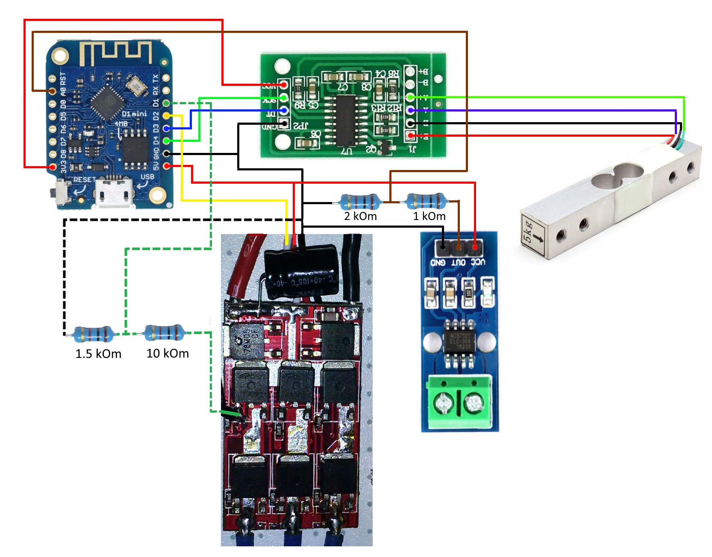

# Измеритель тяги пропеллеров  

Данное устройство позволяет измерять тягу пропеллеров/двигателей. Себестоимость копейки :)  

Видео по устройству https://youtu.be/8d3VAN8VFEA

Комплектующие  
d1mini  
https://ali.ski/NLnax  
как у меня - https://ali.ski/Vyts6  

HX711 и тензодатчик  
https://ali.ski/DXF969  

ACS712  
https://ali.ski/aLz6B5  

Резисторы  
10 кОм - 1шт  
1,5 кОм - 1 шт  
2 кОм  - 1 шт  
1 кОм  - 1 шт  

Для получение RPM берем любой самолетный регулятор, на нем легче подпаятся и схема и них у всех одинаковая.  

STL файлы  
[Мотормаунт](docs/motormaunt_2212.stl)  
[Опора](docs/main.stl)

Приложение  
https://github.com/Afinogen/trust-meter-desktop-app  

Поддержать проект  
https://paypal.me/afinogen89  
https://yoomoney.ru/to/410012470469439  

## Схема подключения

## Компиляция и загрузка проекта в Arduino IDE  
1. Запустить Arduino IDE  
2. Создать ный скет и вставить в него код из файла https://github.com/Afinogen/trust-meter/blob/master/src/main.cpp  
3. В панели Инструменты - Плата выбрать нужную плату (Arduino Nano/Uno, ESP зависит от того, что у Вас есть).
4. Если используется ESP8266 и им подобные, то расскоментировать строку №8 (#define ESP8266 1)      
    Если нужено подключение по WiFi - раскомментировать строку №7 (#define USE_WIFI 1) - только для ESP!
    Если у Вас МК ATmega (328, 2560) раскомметировать строку №9 (#define ATMEGA 1)
5. Установить библиотеку HX711. В панели - Инструменты -> Управлять библиотеками. Через поиск найти эту библиотку, будет первая в списке.
6. Установить библиотеку ACS712, автор Ruslan Koptiev. На строке №28 файла main.cpp указать свой датчик. По умолчанию на 20А  
7. Нажать кнопку "Проверить", все должно нормально собраться
8. Загрузить скетч нажав кнопку "Загрузка"

## Компиляция и загрузка проекта в Platform io  
1. Установить PlatformIO в любимый редактор  - https://platformio.org/install/integration
    Инструкции по установке https://alexgyver.ru/platformio-%D0%B7%D0%B0%D0%BC%D0%B5%D0%BD%D0%B0-arduino-ide/  https://micro-pi.ru/platformio-visual-studio-code-arduino/  
2. Скачивать проект с главной страницы https://github.com/Afinogen/trust-meter  
3. Распаковать архив в отдельную папку  
4. Открыть проект  
5. В файле platformio.ini на 12 строке указать окружение сборки (ATmega328P, megaatmega2560, d1, d1mini), зависит от вашей платы  
6. На строке №28 файла main.cpp указать свой датчик. По умолчанию на 20А  
7. Нажать кнопку "Build", должно все собраться без ошибок, ide сама скачает нужные библиотеки  
8. Подключить плату по usb и нажать кнопку "Upload". Произойдет загрузка прошивки  

## Для разработчиков  
[Описание комманд](docs/commands.md)
